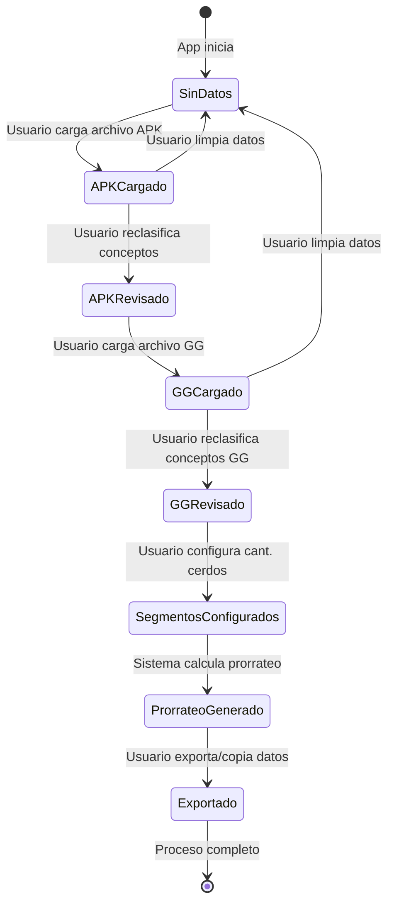

# 📐 Modelo de Dominio - Sistema Contpaq

## 🎯 Propósito del Sistema

Sistema para procesar archivos Excel exportados de Contpaq, reclasificar movimientos contables por conceptos de gasto, y generar reportes para análisis financiero de producción porcina.

---

## 🏗️ Entidades del Dominio

### **1. Movimiento Contable (Record)**

Representa una transacción financiera individual extraída del Excel de Contpaq.

**Atributos:**
- `id`: number (auto-incremental)
- `fecha`: string (formato: "DD/Mmm/YYYY")
- `egresos`: string (tipo de movimiento: "Egresos", "Diario")
- `folio`: number (número de folio)
- `proveedor`: string (nombre del proveedor original)
- `factura`: string (referencia/factura, ej: "F/3535")
- `importe`: number (monto del cargo, puede ser negativo)
- `concepto`: string (categoría de gasto reclasificada)
- `vuelta`: string (segmento/lote de producción)
- `mes`: string (mes extraído de la fecha)
- `año`: number (año extraído de la fecha)

**Invariantes:**
- Cada movimiento pertenece a exactamente UN concepto
- El importe puede ser negativo, positivo o cero
- La vuelta/segmento debe existir en la lista de segmentos válidos

---

### **2. Concepto (Concept)**

Categoría de gasto predefinida para clasificar movimientos.

**Atributos:**
- `id`: string (UUID generado con timestamp)
- `text`: string (nombre del concepto, 1-100 caracteres)
- `createdAt`: string (ISO timestamp)

**Conceptos Predefinidos:**
1. ALIMENTO
2. LECHONES
3. OBRA CIVIL
4. SUELDOS GJAS (Sueldos Granjas)
5. SUELDOS ADMON (Sueldos Administración)
6. MEDICINA
7. VACUNA
8. GASOLINA
9. RENTA
10. VARIOS
11. EQ. TRANSPORTE
12. ENERGIA ELECTRICA
13. DIESEL
14. LIMPIEZA
15. GAS
16. UNIFORMES Y BOTAS

**Reglas:**
- Los conceptos son gestionados manualmente por el usuario
- Se almacenan en localStorage para persistencia
- Sirven como catálogo para reclasificación

---

### **3. Segmento/Vuelta (Segment)**

Lote de producción porcina identificado por número y código.

**Atributos:**
- `segment`: string (identificador único, ej: "19 EPK2-42.2")
- `count`: number (cantidad de cerdos en el lote, para prorrateo)

**Formato:**
```
[Número] [Código]
Ejemplo: "19 EPK2-42.2"
         "20 EPK2-43"
```

**Reglas:**
- Los segmentos se extraen automáticamente del Excel
- Cada segmento es único incluso si comparten prefijo
- El campo `count` se configura manualmente por el usuario para cálculos de prorrateo

---

### **4. Cuenta Contable (Account)**

Estructura jerárquica de cuentas del plan contable.

**Atributos:**
- `code`: string (formato: "XXX-XXX-XXX-XXX-XX")
- `name`: string (descripción de la cuenta)

**Jerarquía:**
```
133-000-000-000-00 (Cuenta Padre: PRODUCCION DE CERDOS EN PROCESO)
  ├─ 133-020-000-000-00 (OBRA CIVIL)
  ├─ 133-023-000-000-00 (UNIFORMES T BOTAS)
  ├─ 133-024-000-000-00 (VARIOS)
  └─ 133-025-000-000-00 (MANTO.EQUIPO TRANSPORTE)
```

**Reglas de Reclasificación Automática (por subcuenta):**
- Subcuentas 20, 34, 37, 39 → VARIOS
- Subcuenta 30 → DEPRECIACIONES
- Subcuenta 25 → EQ. TRANSPORTE
- Subcuenta 18 → DIESEL
- Subcuenta 17 → GASOLINA
- Proveedores que inician con "GRANJ" → SUELDOS GJAS
- Proveedores que inician con "ADMIN" → SUELDOS ADMON

---

### **5. Proceso de Datos (ProcessData)**

Estructura principal que contiene todos los datos procesados en localStorage.

**Atributos:**
```typescript
{
  data: ApkRecord[],        // Movimientos del archivo APK (por vueltas)
  segments: Segment[],      // Lista de segmentos/vueltas
  gg: GgRecord[],          // Movimientos del archivo GG (gastos generales)
  prorrateo: ProrrateoRecord[]  // Movimientos prorrateados
}
```

---

## 🔗 Relaciones entre Entidades

```
┌─────────────────┐
│  ProcessData    │
│  (localStorage) │
└────────┬────────┘
         │
         ├──► ApkRecord[] (data)
         │      │
         │      └──► Concepto (FK: concepto)
         │      └──► Segmento (FK: vuelta)
         │
         ├──► GgRecord[] (gg)
         │      │
         │      └──► Concepto (FK: concepto)
         │
         ├──► Segment[] (segments)
         │
         └──► ProrrateoRecord[] (prorrateo)
                │
                └──► Concepto (FK: concepto)
                └──► Segmento (FK: vuelta)

┌─────────────────┐
│   Concepts      │
│  (localStorage) │
└─────────────────┘
      │
      └──► Concept[]
```

---

## 📊 Tipos de Archivos

### **APK (Archivo Principal por Vueltas)**
- Contiene movimientos ya asignados a vueltas específicas
- Cada movimiento tiene una vuelta/segmento asociado
- Se procesa PRIMERO

### **GG (Gastos Generales)**
- Contiene movimientos que NO están asignados a vueltas específicas
- Deben distribuirse (prorratear) entre todas las vueltas
- Se procesa SEGUNDO
- Usa reglas de reclasificación más estrictas

---

## 🔄 Estados del Sistema



---

## 🎨 Diagrama de Clases (Notación UML)

```
┌─────────────────────────┐
│   <<interface>>         │
│   BaseRecord            │
├─────────────────────────┤
│ + id: number            │
│ + fecha: string         │
│ + egresos: string       │
│ + folio: string         │
│ + proveedor: string     │
│ + factura: string       │
│ + importe: number       │
│ + concepto: string      │
│ + mes: string           │
│ + año: string           │
└─────────────────────────┘
           △
           │ implements
    ┌──────┴──────┐
    │             │
┌───┴────┐   ┌───┴────┐
│ApkRecord│   │GgRecord│
├─────────┤   ├─────────┤
│+vuelta  │   │+segmento│
└─────────┘   └─────────┘

┌─────────────────────────┐
│   Concept               │
├─────────────────────────┤
│ + id: string            │
│ + text: string          │
│ + createdAt: string     │
└─────────────────────────┘

┌─────────────────────────┐
│   Segment               │
├─────────────────────────┤
│ + segment: string       │
│ + count: number         │
└─────────────────────────┘
```

---

## 📐 Reglas de Negocio Principales

### **RN-001: Reclasificación de Conceptos**
- Cada movimiento DEBE tener exactamente un concepto
- La reclasificación puede ser automática (por reglas) o manual (usuario)
- Las reglas automáticas se aplican durante el procesamiento inicial

### **RN-002: Prorrateo de Gastos Generales**
- Los GG se distribuyen proporcionalmente entre vueltas
- Fórmula: `ImporteVuelta = ImporteGG × (CerdosVuelta / TotalCerdos)`
- El prorrateo genera nuevos registros (no modifica existentes)

### **RN-003: Validación de Archivos**
- Formato obligatorio: `.xls` o `.xlsx`
- Debe contener las columnas: Fecha, Tipo, Número, Concepto, Ref, Cargos
- Las filas con fecha válida (DD/Mmm/YYYY) son procesadas como movimientos

### **RN-004: Persistencia de Datos**
- Los datos se almacenan en localStorage del navegador
- El usuario debe poder reiniciar el proceso borrando datos (actualmente con DevTools)
- No hay sincronización entre pestañas

---

## 🎯 Casos de Uso Principales

1. **CU-001**: Cargar y procesar archivo APK
2. **CU-002**: Reclasificar conceptos manualmente
3. **CU-003**: Cargar y procesar archivo GG
4. **CU-004**: Configurar cantidades de cerdos por vuelta
5. **CU-005**: Generar prorrateo de gastos generales
6. **CU-006**: Filtrar y visualizar movimientos
7. **CU-007**: Exportar/copiar datos procesados
8. **CU-008**: Gestionar catálogo de conceptos

---

## 📝 Notas de Implementación

- **Offline-first**: La aplicación debe funcionar completamente sin internet
- **No hay backend**: Todo el procesamiento es cliente-side
- **Exportación**: Formato de texto tabulado (TSV) para copiar/pegar en Excel
- **Mejora futura**: Implementar historial de cambios (undo/redo)
