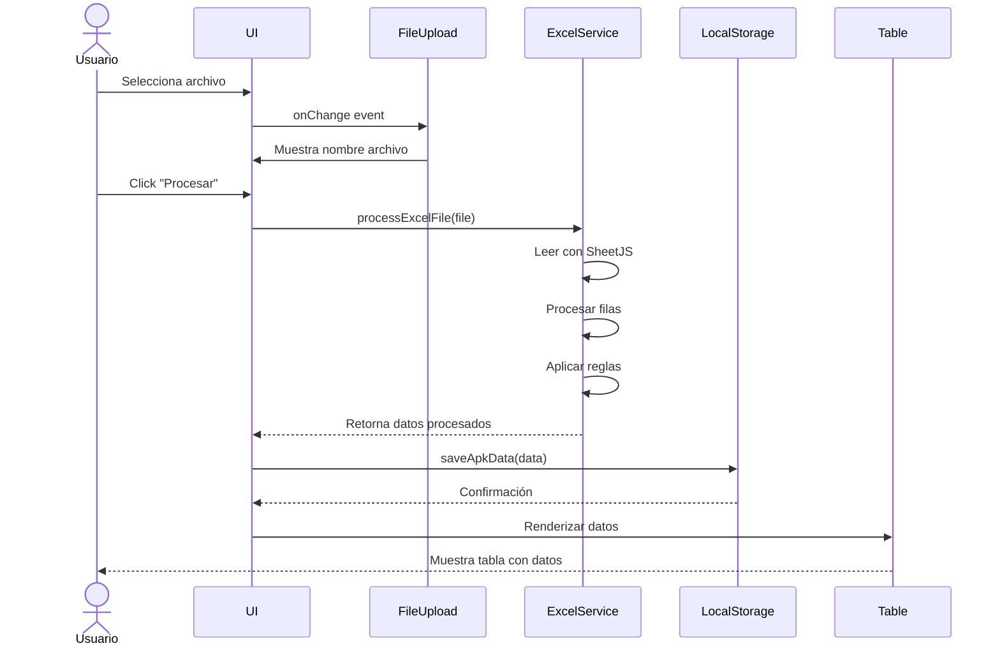

# 🎬 Casos de Uso Detallados - Sistema Contpaq

## 📋 Índice de Casos de Uso

1. [CU-001: Cargar y procesar archivo APK](#cu-001-cargar-y-procesar-archivo-apk)
2. [CU-002: Reclasificar conceptos manualmente](#cu-002-reclasificar-conceptos-manualmente)
3. [CU-003: Cargar y procesar archivo GG](#cu-003-cargar-y-procesar-archivo-gg)
4. [CU-004: Configurar cantidades de cerdos](#cu-004-configurar-cantidades-de-cerdos)
5. [CU-005: Generar prorrateo](#cu-005-generar-prorrateo)
6. [CU-006: Filtrar movimientos](#cu-006-filtrar-movimientos)
7. [CU-007: Exportar datos](#cu-007-exportar-datos)
8. [CU-008: Gestionar conceptos](#cu-008-gestionar-conceptos)

---

## CU-001: Cargar y procesar archivo APK

### 📊 Información General
- **Actor**: Usuario
- **Precondiciones**: Ninguna
- **Postcondiciones**: Datos APK cargados en localStorage, tabla visible
- **Frecuencia**: 1 vez por período (mensual)

### 🔄 Flujo Principal

1. Usuario selecciona tipo de datos "APK/Vueltas"
2. Usuario hace clic en botón "Seleccionar archivo Excel"
3. Sistema abre selector de archivos
4. Usuario selecciona archivo `.xlsx` o `.xls`
5. Sistema muestra nombre del archivo seleccionado
6. Usuario hace clic en "Procesar archivo"
7. Sistema valida formato del archivo
8. Sistema lee contenido del archivo usando SheetJS
9. Sistema procesa datos:
   - Identifica cuentas contables (regex: `\d{3}-\d{3}-\d{3}-\d{3}-\d{2}`)
   - Identifica segmentos (líneas que inician con "Segmento:")
   - Extrae movimientos (líneas con fecha DD/Mmm/YYYY)
   - Aplica reglas de reclasificación automática
10. Sistema guarda datos en localStorage
11. Sistema genera y muestra tabla con columnas:
    - ID, Fecha, Egresos, Folio, Proveedor, Factura, Importe, Concepto, Vuelta, Mes, Año
12. Sistema muestra totales (general y filtrado)
13. Sistema habilita funcionalidades de tabla (filtros, ordenamiento, verificación)

### ⚠️ Flujos Alternativos

**FA-001: Archivo con formato inválido**
- 7a. Sistema detecta que el archivo no es Excel válido
- 7b. Sistema muestra mensaje de error: "El archivo no es válido. Asegúrate de subir un archivo .xls o .xlsx"
- 7c. Flujo termina

**FA-002: Archivo sin columnas esperadas**
- 9a. Sistema detecta que faltan columnas requeridas
- 9b. Sistema muestra mensaje: "El archivo no tiene el formato esperado de Contpaq"
- 9c. Flujo termina

**FA-003: Archivo sin movimientos válidos**
- 9a. Sistema no encuentra ninguna fila con formato de fecha válido
- 9b. Sistema muestra advertencia: "No se encontraron movimientos en el archivo"
- 9c. Flujo continúa pero tabla queda vacía

### ✅ Criterios de Aceptación

- [ ] Solo acepta archivos .xls y .xlsx
- [ ] Procesa correctamente fechas en formato DD/Mmm/YYYY
- [ ] Identifica todas las cuentas contables con regex
- [ ] Extrae segmentos/vueltas únicos
- [ ] Aplica reclasificación automática según subcuenta
- [ ] Genera IDs auto-incrementales únicos
- [ ] Almacena datos en localStorage bajo clave "apk"
- [ ] Muestra mensaje de éxito al finalizar

### 📝 Reglas de Reclasificación Automática

```javascript
// Por subcuenta (segundo grupo de dígitos)
subcuenta 20, 34, 37, 39 → VARIOS
subcuenta 30 → DEPRECIACIONES
subcuenta 25 → EQ. TRANSPORTE
subcuenta 18 → DIESEL
subcuenta 17 → GASOLINA

// Por proveedor
proveedor inicia con "GRANJ" → SUELDOS GJAS
proveedor inicia con "ADMIN" → SUELDOS ADMON
```

---

## CU-002: Reclasificar conceptos manualmente

### 📊 Información General
- **Actor**: Usuario
- **Precondiciones**: Datos APK o GG cargados
- **Postcondiciones**: Conceptos actualizados en localStorage
- **Frecuencia**: Múltiples veces por sesión

### 🔄 Flujo Principal (Modo Individual)

1. Usuario hace clic en una fila de la tabla
2. Sistema abre modal de edición individual mostrando:
   - Fecha, Proveedor, Factura, Concepto Actual, Vuelta
3. Sistema carga selector con conceptos guardados
4. Usuario selecciona nuevo concepto del dropdown
5. Sistema habilita botón "Cambiar"
6. Usuario hace clic en "Cambiar"
7. Sistema actualiza el registro en localStorage
8. Sistema actualiza la fila en la tabla
9. Sistema cierra el modal
10. Sistema muestra notificación de éxito

### 🔄 Flujo Alternativo (Modo Verificación Carrusel)

1. Usuario hace clic en botón "Verificar"
2. Sistema abre modal tipo carrusel mostrando primer registro
3. Sistema muestra:
   - Contador: "Registro X de Y"
   - Datos del registro actual
   - Selector de conceptos
   - Botones: Anterior, Siguiente, Cambiar, Saltar
4. Usuario navega entre registros con flechas o botones
5. Usuario selecciona concepto cuando necesita cambiar
6. Usuario hace clic en "Cambiar" o "Saltar"
7. Sistema guarda cambio (si aplica)
8. Sistema avanza al siguiente registro
9. Repetir hasta revisar todos o cerrar modal

### 🔄 Flujo de Sustitución Masiva

1. Sistema muestra panel "Sustitución Masiva de Conceptos"
2. Sistema lista todos los conceptos únicos con checkboxes
3. Usuario selecciona múltiples conceptos origen
4. Usuario selecciona concepto destino del dropdown
5. Sistema muestra resumen: "Reemplazar X conceptos en Y registros"
6. Usuario hace clic en "Vista Previa"
7. Sistema muestra modal con cambios propuestos
8. Usuario revisa cambios
9. Usuario hace clic en "Ejecutar Sustitución"
10. Sistema actualiza todos los registros afectados
11. Sistema actualiza tabla
12. Sistema muestra confirmación

### ⚠️ Flujos Alternativos

**FA-001: Cancelación de cambio**
- 6a. Usuario hace clic en "Cerrar" o ESC
- 6b. Sistema descarta cambios no guardados
- 6c. Sistema cierra modal

**FA-002: Navegación con teclado (Carrusel)**
- ← Tecla Izquierda: Registro anterior
- → Tecla Derecha: Registro siguiente
- Enter: Confirmar cambio
- ESC: Cerrar carrusel

### ✅ Criterios de Aceptación

- [ ] Modal individual se abre al hacer clic en fila
- [ ] Carrusel navega correctamente entre registros
- [ ] Cambios se persisten en localStorage inmediatamente
- [ ] Tabla se actualiza en tiempo real
- [ ] Sustitución masiva muestra vista previa
- [ ] No se permite sustitución sin seleccionar destino
- [ ] Indicador visual de concepto actual vs nuevo

---

## CU-003: Cargar y procesar archivo GG

### 📊 Información General
- **Actor**: Usuario
- **Precondiciones**: Archivo APK ya procesado (recomendado)
- **Postcondiciones**: Datos GG cargados, listo para prorrateo
- **Frecuencia**: 1 vez por período

### 🔄 Flujo Principal

1. Usuario selecciona tipo de datos "GG's"
2. Usuario hace clic en "Seleccionar archivo Excel"
3. Sistema abre selector de archivos
4. Usuario selecciona archivo GG
5. Usuario hace clic en "Procesar archivo"
6. Sistema valida archivo (mismo proceso que APK)
7. Sistema procesa datos aplicando reglas de GG:
   - Reclasificación más agresiva (subcuentas específicas)
   - Asigna "Segmento" en lugar de "Vuelta"
8. Sistema guarda en localStorage bajo `processData.gg`
9. Sistema actualiza tabla mostrando columna "Segmento" en lugar de "Vuelta"
10. Sistema habilita botón "Confirmar Prorrateo"
11. Sistema muestra mensaje de éxito

### ✅ Criterios de Aceptación

- [ ] Mismo proceso de validación que APK
- [ ] Aplica reglas de reclasificación específicas de GG
- [ ] Almacena en clave separada de APK
- [ ] Tabla muestra "Segmento" en lugar de "Vuelta"
- [ ] Botón prorrateo se habilita solo si APK y GG existen

---

## CU-004: Configurar cantidades de cerdos

### 📊 Información General
- **Actor**: Usuario
- **Precondiciones**: Archivo APK procesado (segmentos detectados)
- **Postcondiciones**: Cantidades configuradas para prorrateo
- **Frecuencia**: 1 vez por período, ajustable

### 🔄 Flujo Principal

1. Sistema detecta segmentos en archivo APK
2. Sistema muestra sección "Editar Segmentos"
3. Sistema genera formulario dinámico con:
   - Lista de segmentos detectados
   - Input numérico por cada segmento (valor inicial: 0)
4. Usuario ingresa cantidad de cerdos por vuelta
5. Usuario hace clic en "Aceptar"
6. Sistema valida que sean números enteros >= 0
7. Sistema actualiza `processData.segments` en localStorage
8. Sistema muestra notificación de éxito
9. Sistema actualiza indicador de prorrateo

### ⚠️ Flujos Alternativos

**FA-001: Valores inválidos**
- 6a. Usuario ingresa valor negativo o no numérico
- 6b. Sistema muestra error en el campo específico
- 6c. Sistema no permite guardar hasta corregir

### ✅ Criterios de Aceptación

- [ ] Formulario se genera automáticamente por segmentos detectados
- [ ] Acepta solo números enteros no negativos
- [ ] Valores se persisten en localStorage
- [ ] Muestra total de cerdos en resumen

---

## CU-005: Generar prorrateo

### 📊 Información General
- **Actor**: Usuario
- **Precondiciones**: APK + GG cargados, segmentos configurados
- **Postcondiciones**: Datos prorrateados generados y visibles
- **Frecuencia**: 1 vez por período, regenerable

### 🔄 Flujo Principal

1. Usuario verifica indicadores:
   - ✅ Archivo APK cargado
   - ✅ Archivo GG cargado
   - ✅ Segmentos configurados
2. Usuario hace clic en "Confirmar Prorrateo"
3. Sistema muestra sección "Prorrateo de Gastos Generales"
4. Usuario hace clic en "Generar Prorrateo"
5. Sistema calcula distribución:
   ```javascript
   totalCerdos = suma(segment.count para todos los segmentos)
   
   para cada movimientoGG:
     para cada segmento:
       importeProrrateado = movimientoGG.importe × (segmento.count / totalCerdos)
       crear nuevoRegistro con:
         - todos los datos del movimientoGG
         - vuelta = segmento.segment
         - importe = importeProrrateado
   ```
6. Sistema guarda registros en `processData.prorrateo`
7. Sistema genera tabla de prorrateo
8. Sistema muestra resumen:
   - Conceptos GG: X
   - Vueltas: Y
   - Total Cerdos: Z
   - Registros Generados: N
   - Total Prorrateo: $XXX,XXX.XX
9. Sistema habilita botones: Copiar, Descargar

### ✅ Criterios de Aceptación

- [ ] Solo se habilita con APK, GG y segmentos listos
- [ ] Cálculo de prorrateo es preciso (regla de tres)
- [ ] Total prorrateado = Total GG original
- [ ] Genera registros con estructura idéntica a APK
- [ ] Tabla muestra todos los movimientos prorrateados
- [ ] Resumen muestra métricas correctas

---

## CU-006: Filtrar movimientos

### 📊 Información General
- **Actor**: Usuario
- **Precondiciones**: Datos cargados en tabla
- **Postcondiciones**: Vista filtrada de movimientos
- **Frecuencia**: Múltiples veces por sesión

### 🔄 Flujo Principal

1. Sistema muestra panel de filtros con:
   - Input de texto: Proveedor (búsqueda parcial)
   - Dropdown: Concepto (valores únicos)
   - Dropdown: Vuelta (solo para APK, valores únicos)
2. Usuario ingresa texto en filtro de proveedor
3. Sistema filtra tabla en tiempo real (case-insensitive)
4. Usuario selecciona concepto del dropdown
5. Sistema combina filtros (AND lógico)
6. Sistema actualiza:
   - Filas visibles en tabla
   - Contador: "X registros encontrados"
   - Total Filtrado: $XXX,XXX.XX
7. Usuario hace clic en "Limpiar"
8. Sistema resetea todos los filtros
9. Sistema muestra todos los registros

### ✅ Criterios de Aceptación

- [ ] Filtros se aplican en tiempo real
- [ ] Búsqueda de proveedor es case-insensitive
- [ ] Filtros se combinan con lógica AND
- [ ] Totales se recalculan con datos filtrados
- [ ] Botón limpiar resetea todos los filtros

---

## CU-007: Exportar datos

### 📊 Información General
- **Actor**: Usuario
- **Precondiciones**: Datos procesados en tabla
- **Postcondiciones**: Datos copiados o descargados
- **Frecuencia**: 1-2 veces por período

### 🔄 Flujo Principal (Copiar al Portapapeles)

1. Usuario hace clic en botón "Copiar"
2. Sistema genera texto tabulado (TSV):
   - Filas separadas por `\n`
   - Columnas separadas por `\t`
   - Incluye encabezados
3. Sistema usa `navigator.clipboard.writeText()`
4. Sistema muestra toast: "¡Copiado al portapapeles!"
5. Usuario puede pegar en Excel/Google Sheets

### 🔄 Flujo Alternativo (Descargar Excel - solo Prorrateo)

1. Usuario hace clic en "Descargar" en sección de prorrateo
2. Sistema genera archivo Excel usando SheetJS
3. Sistema nombra archivo: `Prorrateo_[MesAño].xlsx`
4. Sistema descarga archivo al navegador
5. Sistema muestra confirmación

### ✅ Criterios de Aceptación

- [ ] Formato TSV compatible con Excel
- [ ] Incluye encabezados en primera fila
- [ ] Respeta orden de columnas
- [ ] Montos mantienen formato numérico
- [ ] Toast desaparece automáticamente (3 segundos)
- [ ] Descarga usa SheetJS para Excel válido

---

## CU-008: Gestionar conceptos

### 📊 Información General
- **Actor**: Usuario
- **Precondiciones**: Ninguna
- **Postcondiciones**: Catálogo de conceptos actualizado
- **Frecuencia**: Ocasional (setup inicial o ajustes)

### 🔄 Flujo Principal (Agregar Concepto)

1. Usuario ingresa texto en input "Escribe un nuevo concepto..."
2. Sistema valida en tiempo real:
   - No vacío
   - Máximo 100 caracteres
3. Sistema habilita/deshabilita botón "Agregar" según validación
4. Usuario hace clic en "Agregar" (o presiona Enter)
5. Sistema crea objeto Concepto:
   ```javascript
   {
     id: Date.now().toString(),
     text: valorIngresado.trim(),
     createdAt: new Date().toISOString()
   }
   ```
6. Sistema guarda en localStorage
7. Sistema renderiza concepto en lista
8. Sistema actualiza contador
9. Sistema limpia input

### 🔄 Flujo Alternativo (Editar Concepto)

1. Usuario hace clic en botón "Editar" de un concepto
2. Sistema convierte item a modo edición (input inline)
3. Usuario modifica texto
4. Usuario hace clic en "Guardar" o presiona Enter
5. Sistema valida (mismas reglas)
6. Sistema actualiza en localStorage
7. Sistema vuelve a modo vista

### 🔄 Flujo Alternativo (Eliminar Concepto)

1. Usuario hace clic en botón "Eliminar"
2. Sistema muestra confirmación
3. Usuario confirma
4. Sistema elimina de localStorage
5. Sistema remueve de lista
6. Sistema actualiza contador

### 🔄 Flujo Alternativo (Limpiar Todos)

1. Usuario hace clic en "Limpiar Todo"
2. Sistema muestra confirmación
3. Usuario confirma
4. Sistema vacía array de conceptos en localStorage
5. Sistema muestra mensaje "No hay conceptos guardados"

### ✅ Criterios de Aceptación

- [ ] Input valida en tiempo real
- [ ] No permite duplicados (opcional)
- [ ] Edición inline funcional
- [ ] Eliminación requiere confirmación
- [ ] Contador se actualiza automáticamente
- [ ] Lista vacía muestra mensaje instructivo
- [ ] Cambios se persisten inmediatamente

---

## 📐 Diagramas de Secuencia (Mermaid)

### Procesamiento de Archivo APK



---

## 🎯 Matriz de Trazabilidad

| Caso de Uso | Features Afectados | Componentes Principales |
|-------------|-------------------|-------------------------|
| CU-001 | file-upload, data-table | FileUploadForm, DataTable, ExcelProcessor |
| CU-002 | data-table, mass-replacement | RecordEditModal, VerificationCarousel, MassReplacementPanel |
| CU-003 | file-upload, data-table | FileUploadForm, DataTable, ExcelProcessor |
| CU-004 | segment-editor | SegmentEditorForm |
| CU-005 | prorrateo | ProrrateoGenerator, ProrrateoTable |
| CU-006 | data-table | TableFilters |
| CU-007 | data-table, prorrateo | ExportButton, CopyButton |
| CU-008 | concepts | ConceptsManager, ConceptForm, ConceptList |
